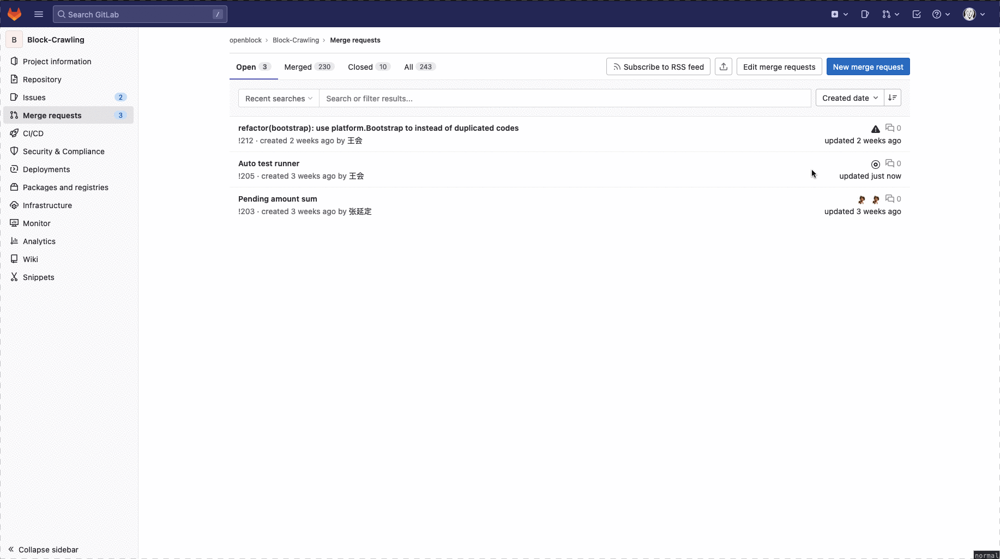

## 安装 node-driver

### 本地开发

参见： [gitlab.bixin.com/mili/node-driver](https://gitlab.bixin.com/mili/node-driver)。

### 服务器部署

服务器无法通过 SSH 访问 GitLab，所以只能通过脚本 clone 并在 go.mod 中进行 replace，
执行 `deploy-node-driver.sh`:

``` bash
./deploy-node-driver.sh
```

## Kratos Project

```
doc: https://go-kratos.dev/docs/
code: https://github.com/go-kratos/kratos
```

## Build && Run

```
go build -o ./bin/ ./...
./bin/server -conf ./configs
```

## Docker

```bash
# build
docker build -t <your-docker-image-name> .

# run
docker run --rm -p 8666:8666 -v </path/to/your/configs>:/data/conf <your-docker-image-name>
```

## Trigger Auto Test



### Use Docker to Start a PostgresQL Instance

1. Install [Docker Desktop](https://www.docker.com/products/docker-desktop/)
2. [Configure Mirror to Speedup](https://yeasy.gitbook.io/docker_practice/install/mirror#macos)
3. Run Tests

   ```shell
   make test
   ```
